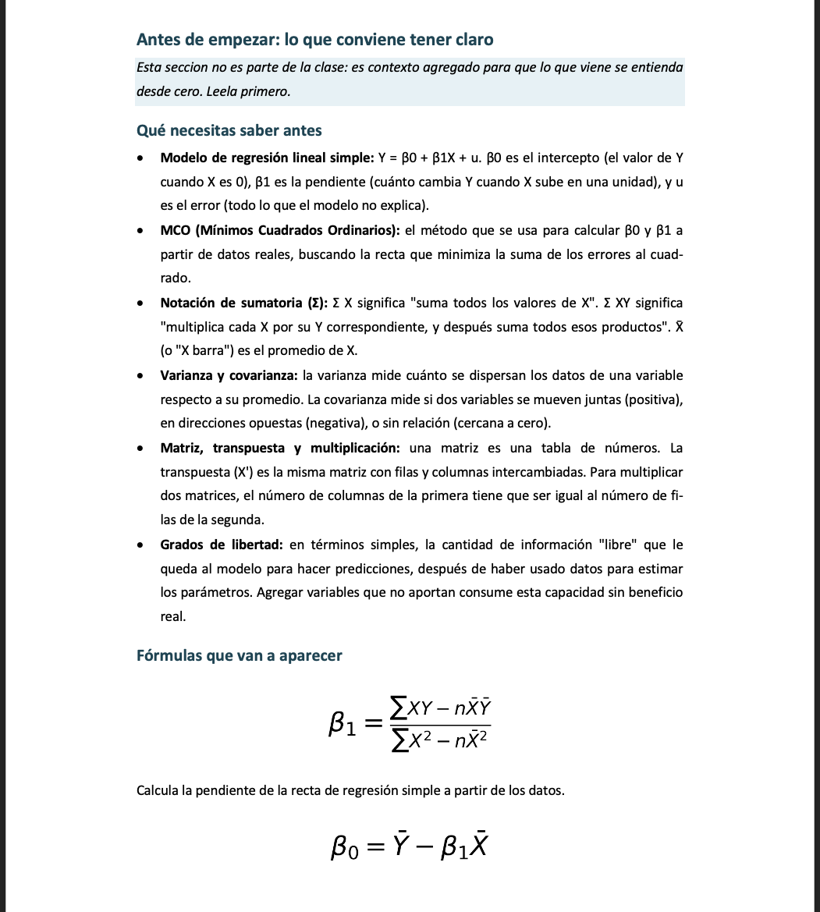
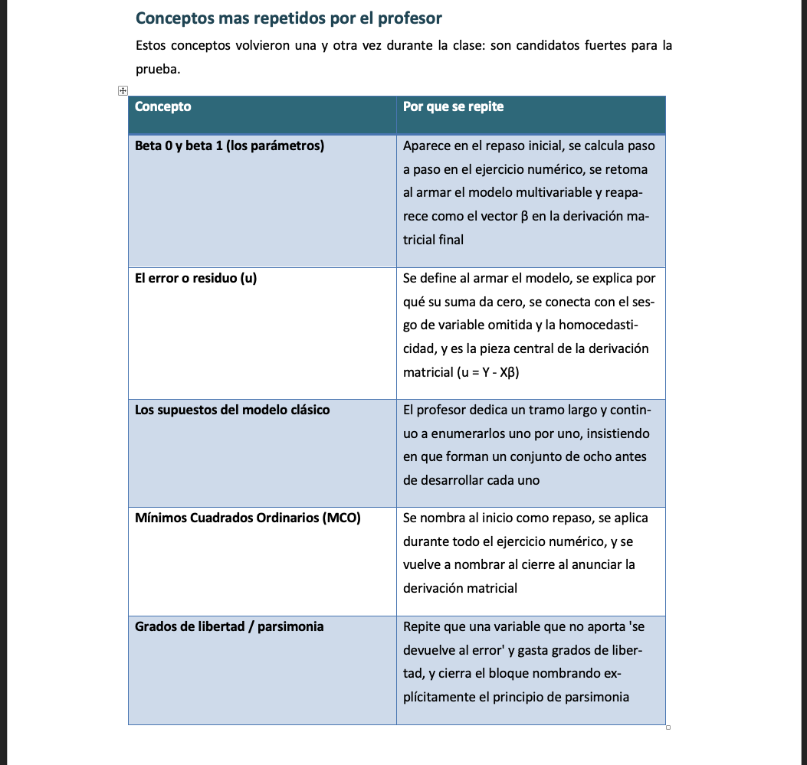
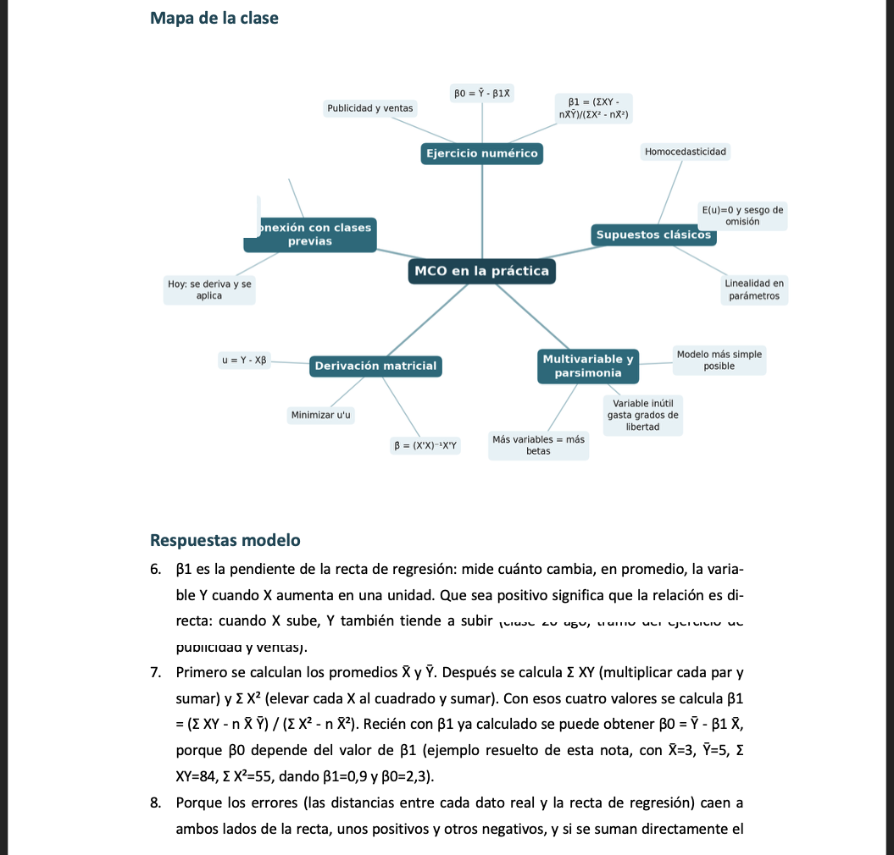
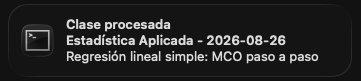

# Orquestador de estudio

Suelta el audio de tu clase, haz un clic, y el sistema transcribe, destila las ideas en
apuntes reales (no un resumen plano), revisa su propio trabajo con un segundo agente
independiente, arma un `.docx` para leer y estudiar, archiva el audio, agrega las
preguntas a Anki, y te avisa cuando termina. Todo en tu propio Mac, sin subir nada a
ningún lado.

## Así se ve

<table>
<tr>
<td width="50%">

<br><sub>Las fórmulas se dibujan con tipografía matemática real, no como texto plano.</sub>
</td>
<td width="50%">

<br><sub>El sistema nota qué se repitió durante la clase y por qué, no solo transcribe.</sub>
</td>
</tr>
<tr>
<td width="50%">

<br><sub>El mapa de la clase se dibuja de verdad, no se describe en palabras.</sub>
</td>
<td width="50%">

<br><sub>Notificación nativa de macOS al terminar, con clic para abrir el documento.</sub>
</td>
</tr>
</table>

*(Ejemplo con datos de una clase ficticia. Nada de contenido real de clases sale de este
Mac, ver [Privacidad](#privacidad).)*

## Cómo funciona por dentro

1. **Transcribe** el audio con Whisper, corriendo en tu propio Mac.
2. Un agente **destila** la transcripción en apuntes: ideas centrales explicadas desde
   cero, preguntas con respuesta modelo, sesión de estudio y kit de repaso.
3. Un **segundo agente independiente**, en una sesión aparte que llega sin haber escrito
   nada, revisa esas notas contra la transcripción cruda y busca contenido sin respaldo.
   Si encuentra algo grave, manda a corregirlo antes de seguir.
4. Arma el `.docx`, archiva el audio por ramo y fecha, agrega las preguntas a Anki, y
   avisa con una notificación nativa de macOS (o si algo falló).

Todo el uso del día a día pasa por dos apps de doble clic. Nunca necesitas abrir Terminal
para usarlo, solo para instalarlo la primera vez.

## Decisiones técnicas

**El revisor es una sesión aparte, a propósito.** Nadie mira el material antes de que se
convierta en flashcards, así que la revisión no puede ser una autocrítica dentro de la
misma sesión que escribió las notas: eso sería el agente revisando su propio trabajo con
el mismo sesgo. Llega sin contexto previo y compara contra la transcripción cruda.

**Todo corre local, por diseño y no por casualidad.** El sistema se apoya en el plan
Claude Pro y en Whisper corriendo en el Mac, sin APIs de pago ni servicios que cobren por
uso. Eso significa además que ninguna grabación ni apunte de una clase real sale de tu
equipo.

**Cada llamada al modelo se mide.** Un `CLAUDE.md` propio del pipeline documenta cuánto
cuesta cada etapa y por qué son tres llamadas (escribir, revisar, corregir) y no una sola
ni cuatro. Antes de agregar una etapa nueva, el criterio es medir qué ahorra, no asumirlo.

Guía completa de instalación, uso diario y detalles técnicos de cada decisión en
[docs/INSTALACION.md](docs/INSTALACION.md).

## Estructura del proyecto

```
Input/               Donde dejas las grabaciones nuevas
Output/               .docx generados, uno por clase, ordenados por ramo
Procesados/           Audios ya procesados, archivados por ramo
boton_app/            Las apps de doble clic (Procesar Clases, Configurar Sistema)
orquestador/          El código del pipeline
  config.json          Tu configuracion real (rutas, ramos). No se sube al repo.
  config.example.json  Plantilla de referencia para armar tu propio config.json
  revisor.py           El segundo agente que revisa las notas antes de archivarlas
  carpetas.py          Ubica la carpeta de cada ramo en tu vault (y la recuerda)
  regenerar.py         Rehace el .docx de una clase ya procesada, con el diseño actual
  logs/uso.jsonl       Cuanto consumio cada llamada al modelo
.claude/skills/        La skill que aplica el método de estudio sobre cada transcripción
docs/                  Instalación completa, uso diario y detalles técnicos
```

## Privacidad

`orquestador/config.json` (tus rutas reales), las carpetas `Input/`, `Output/` y
`Procesados/` (tus grabaciones y notas reales), y los archivos de estado interno quedan
fuera del repositorio (ver `.gitignore`). Nada de tu contenido de clases se sube a
GitHub. Detalle de qué cuidar si publicas tu propia copia, en
[docs/INSTALACION.md](docs/INSTALACION.md#si-vas-a-publicar-tu-propia-copia).
